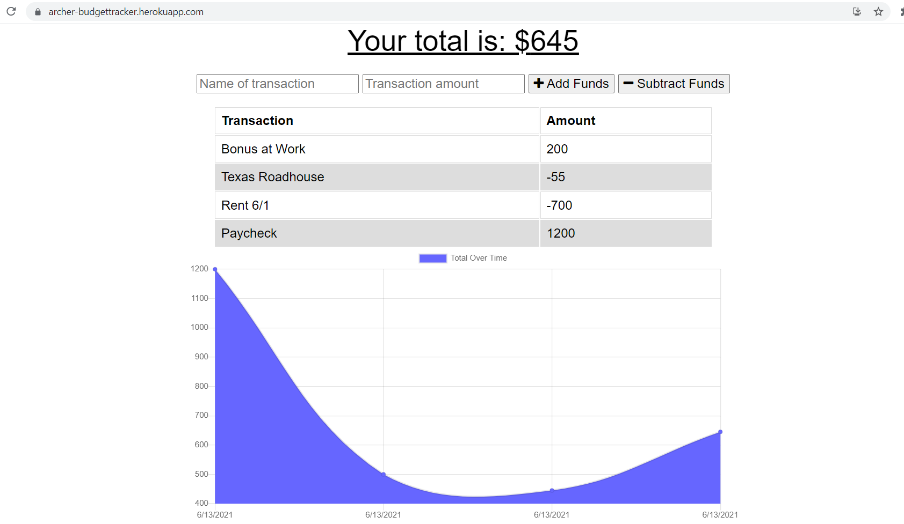

# Budget Tracker : Progessive Web Application

## Table of Contents

* [Description](#description)
* [Installation](#installation)
* [Usage](#usage)
* [Contributing](#contributing)
* [Questions](#questions)
* [License](#license)

## Description

This web application is a simple, but useful tool for helping keep track of your budget and savings from anywhere so that you never run into any overdraft fees ever again. The Budget Tracker PWA is intuitive in that it can easily be saved onto your desktop or mobile device with a click of the button and can even save your transactions until you are connected to the internet. It's simple layout makes it easy to use and view your budget as you see fit. To see the deployed application, go to https://archer-budgettracker.herokuapp.com and get started saving money today!

## Installation

This application is available online at https://archer-budgettracker.herokuapp.com. 

To download the app using Google Chrome Browser, go to right side of the address bar and click on the small gray button that looks like a desktop and arrow. This will download the application onto your desktop. 

To download on an Android device, open up the website in Chrome and tap "Add to home screen". 

To download the Budget Tracker on an Apple iOS device, open the web application in Safari tap the "Share" button and press "Add to Home Screen".

## Usage

This web application is extremely easy to use. To add funds into your budget, simply type the name for your transaction, the amount, and press '+ Add Funds'. To subtract funds do the same, but press 'Subtract Funds'. If you happen to go offline at any time, the application will automatically store the transaction to your cache to be added in once you are connected to the internet again.

## Contributing

This project was made in part by the University of Arizona Coding Bootcamp and Trilogy Education services. Contributions to this website are more than welcome as this is free to use and is open for further development. If you want to reach out to the developer, use the contact info found in the Questions section below.

## Questions

For any additional questions or comments, please email the author of this project at: 
archernich@gmail.com.

*OR*

You can view other repositories made by me at https://github.com/mrarcher2000.

My LinkedIn Profile: https://linked.com/in/archer-nicholson-554829204/

## License
    
This project is licensed under the Open Source MIT License.
A full overview of what this license covers can be found at https://spdx.org/licenses/MIT.html.
    
